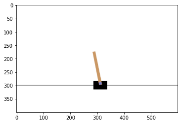

# Deep Q-Network (DQN) Algorithm

This repository contains the implementation of the Deep Q-Network (DQN) algorithm using PyTorch. The goal of this project is to provide a step-by-step guide for implementing the DQN algorithm from scratch, as well as an implementation of the algorithm for the CartPole-v1 environment in OpenAI Gym.

<a href="https://pramishp.github.io/DQN/">Associated Blog</a>
 

## Table of Contents

- [Introduction](#introduction)
- [Requirements](#requirements)
- [Getting Started](#getting-started)
- [Implementation](#implementation)
- [Results](#results)
- [License](#license)

## Introduction

The DQN algorithm is a popular algorithm for solving reinforcement learning problems, particularly in Atari games, and it was introduced by Mnih et al. in their 2015 paper ["Human-level control through deep reinforcement learning"](https://www.nature.com/articles/nature14236). The DQN algorithm uses a deep neural network to approximate the optimal action-value function Q(s,a), which represents the expected return for taking action a in state s. The algorithm uses a replay buffer to store transitions (s, a, r, s') and uses experience replay to train the network on a batch of randomly selected transitions from the buffer.

In this project, we will walk through the steps of implementing the DQN algorithm from scratch using PyTorch. We will start by defining the neural network architecture, then we will implement the replay buffer and the training loop, and finally we will test the algorithm on the CartPole-v1 environment in OpenAI Gym.

## Requirements

To run the code in this repository, you will need the following:

- Python 3.6 or higher
- PyTorch 1.8 or higher
- NumPy
- OpenAI Gym

## Getting Started

To get started, you can clone this repository to your local machine:

`git clone https://github.com/pramishp/DQN-algorithm.git`

Then, navigate to the project directory and open Cartpole.ipynb. This file is self documented.

## Implementation

The implementation of the DQN algorithm is broken down into several steps:

1. Defining the neural network architecture
2. Implementing the replay buffer
3. Implementing the training loop
4. Testing the algorithm on the CartPole-v1 environment in OpenAI Gym
